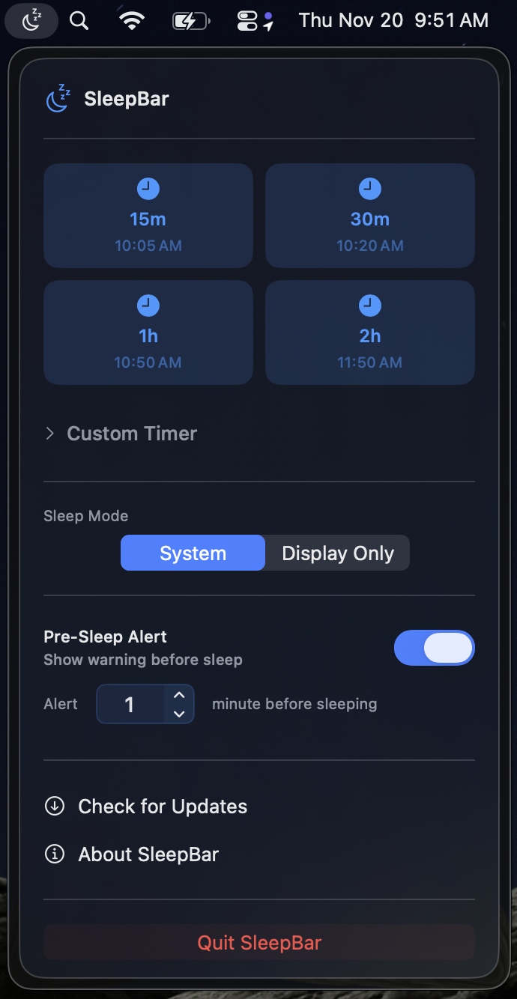

# SleepBar

<p align="center">
  
</p>

<p align="center">
  <strong>A simple and elegant sleep timer for macOS</strong>
</p>

<p align="center">
  <a href="https://github.com/nateships/sleepbar/releases/latest">
    
  </a>
  <a href="https://github.com/nateships/sleepbar/releases">
    
  </a>
  
  
  <a href="LICENSE">
    
  </a>
</p>

---

## About

SleepBar is a menu bar app that puts your Mac to sleep after a duration or at a specific time. Good for:
- Listening to music or podcasts before bed
- Overnight downloads or long-running tasks
- Controlling screen time
- Energy savings

## Features

- **Quick Timers**: Preset options for 15, 30, 60, and 120 minutes
- **Custom Duration**: Set any duration with hours and minutes
- **Specific Time**: Schedule sleep for an exact time
- **Sleep Modes**: Choose system sleep or display-only sleep
- **Pre-Sleep Warning**: Configurable alert before sleep, with snooze and Sleep Now
- **Open at Login**: Start SleepBar when you log in
- **Auto-Updates**: Signed updates via Sparkle

## Download

- **DMG**: [Download SleepBar](https://github.com/nateships/sleepbar/releases/latest/download/SleepBar.dmg)
- **Homebrew**: `brew install --cask nateships/tap/sleepbar`
- **Requirements**: macOS 14.0 (Sonoma) or later

Every download is signed with a Developer ID certificate and notarized by Apple.

## Pricing

- **7-day free trial** (no credit card required)
- **$4.20** one-time purchase, lifetime updates, use on 3 Macs

[Purchase License](https://shop.sleepbar.app/buy/8089829a-1927-4553-9b16-28aacdcfe904)

## Support

- **Website**: [sleepbar.app](https://sleepbar.app)
- **Changelog**: [CHANGELOG.md](CHANGELOG.md)
- **Email**: [hi@sleepbar.app](mailto:hi@sleepbar.app)
- **Issues**: [Report a bug](https://github.com/nateships/sleepbar/issues)

---

## Building from source

The source is here so anyone can read what the app does. Building it yourself is supported. Two things to know:

- **Trial and license**: the code contains the 7-day trial and the Lemon Squeezy license check. A self-built copy behaves like the download. Buying a license supports development.
- **Analytics**: opt-out, anonymous usage events go to a CloudKit container that belongs to the SleepBar developer team. A build signed by a different team cannot write to it. Remove the iCloud entitlement or `TelemetryManager` calls for your own build.

### Requirements

- Xcode 26 (macOS 15+)
- [mise](https://mise.jdx.dev) for the CLI toolchain (`gh`, `xcbeautify`, `actionlint`)
- For tests: Xcode signed in to an Apple Developer team, so the test host can be signed

### Setup

```bash
git clone git@github.com:nateships/sleepbar.git
cd sleepbar
mise install
open SleepBar.xcodeproj
```

### Tasks

```bash
mise run build     # Debug build, no code signing
mise run test      # Unit tests (needs Xcode signed in)
mise run lint      # Lint GitHub Actions workflows
mise tasks         # List everything
```

Build output goes to `build/` (gitignored). The website lives in `site/` and is deployed by Cloudflare Pages from `main`.

### Developer Tools (Debug Builds Only)

**Cmd+Shift+D** or "Developer Tools" in the menu:
- **Reset Trial**: Start a fresh 7-day trial
- **Expire Trial**: Set trial to expired
- **Generate Test Key**: Create a fake license key (does not work with the Lemon Squeezy API)
- **Deactivate License**: Remove current license

---

## Releasing

Releases are built, signed, notarized, and published by GitHub Actions. Nothing is built on a developer machine. Build logs are public; GitHub masks secrets.

### Commits

Commit subjects follow [Conventional Commits](https://www.conventionalcommits.org): `feat:`, `fix:`, `docs:`, `chore:`, `ci:`. Pull requests are squash-merged, so the pull request title is the commit subject. A `feat` bumps the minor version, a `fix` bumps the patch version, and `feat!` or a `BREAKING CHANGE:` footer bumps the major version. Other types do not release.

### Release pull request

[release-please](https://github.com/googleapis/release-please) (`.github/workflows/release-please.yml`) keeps a pull request named `chore(main): release X.Y.Z` open on `main`. It updates `CHANGELOG.md`, `version.txt`, and `.release-please-manifest.json` from the commits since the last release. Edit the changelog in that pull request if a line needs better wording.

Merging it:

1. Creates the tag `vX.Y.Z` and a GitHub release with the changelog section as notes. The release becomes a draft at once, so "latest", the Sparkle feed, and the Homebrew cask stay on the previous version.
2. The tag starts the Release workflow (`.github/workflows/release.yml`), which attaches the assets to the draft and publishes it.

### Dry run

```bash
mise run release-dry-run 1.2.1            # builds main
mise run release-dry-run 1.2.1 my-branch
```

Builds, signs, notarizes, uploads `SleepBar.dmg` as a workflow artifact. Publishes nothing. Use it before merging the release pull request when the build has changed.

### Manual release

```bash
mise run release 1.2.1
```

Publishes without release-please. `CHANGELOG.md` must have a `## [1.2.1]` section, or the run fails. Equivalent: run the workflow from the Actions tab with `publish` checked.

### Version numbers

The tag is the source of truth. CI sets:
- `MARKETING_VERSION` = `1.2.1`
- `CURRENT_PROJECT_VERSION` (Sparkle build number) = `10201` (major×10000 + minor×100 + patch)

The version numbers in the Xcode project are not used for releases. The release notes record the commit that was built.

### What the Release workflow does

1. Imports the Developer ID certificate and provisioning profile into a temporary keychain
2. Archives and exports the app with Developer ID (`scripts/archive.sh`)
3. Notarizes and staples the app (`scripts/notarize.sh app`), so it verifies offline and Sparkle installs it without a round trip to Apple
4. Builds and signs the DMG from the stapled app (`scripts/dmg.sh`)
5. Notarizes and staples the DMG (`scripts/notarize.sh dmg`)
6. Signs the DMG with the Sparkle EdDSA key and writes `build/appcast/appcast.xml`, seeded from the previous release's appcast (`scripts/appcast.sh`)
7. Attaches `SleepBar-1.2.1.dmg`, `SleepBar.dmg` and `appcast.xml` to the draft release and publishes it. A manual release creates the release instead. `https://sleepbar.app/appcast.xml` redirects to the latest release's `appcast.xml` (see `site/_redirects`), so the feed updates the moment the release is published.
8. Bumps `Casks/sleepbar.rb` in `nateships/homebrew-tap`. If only this step fails, rerun the workflow with `tap_only` checked and the version.

### Verify

1. Install the previous version, open "Check for Updates", confirm the update installs.
2. `https://sleepbar.app/appcast.xml` shows the new version.

---

## CI Secrets

Set under Settings → Secrets and variables → Actions. Sources of truth are in 1Password.

| Secret | Content | Source |
|---|---|---|
| `DEVELOPER_ID_P12_BASE64` | Developer ID Application cert + private key, base64 | 1Password "Apple Developer Cert pfx", attached `.p12` |
| `DEVELOPER_ID_P12_PASSWORD` | Password of that `.p12` | same item |
| `DEVELOPER_ID_PROFILE_BASE64` | Developer ID provisioning profile for `app.sleepbar.SleepBar`, base64 | 1Password document "SleepBar Developer ID provisioning profile" |
| `NOTARY_APPLE_ID` | Apple ID email | 1Password "Apple" login |
| `NOTARY_PASSWORD` | App-specific password | 1Password "notarytool app specific password" |
| `SPARKLE_PRIVATE_KEY` | Sparkle EdDSA private key, base64 string | 1Password "SleepBar Sparkle Keys". Public key must match `SUPublicEDKey` in `SleepBar/Info.plist` |
| `HOMEBREW_TAP_TOKEN` | Fine-grained PAT, repository `homebrew-tap`, Contents: read and write | 1Password `rolle` vault, "rolle-homebrew-tap" |
| `RELEASE_PLEASE_TOKEN` | Fine-grained PAT, repository `sleepbar`, Contents and Pull requests: read and write. The default `GITHUB_TOKEN` cannot be used: its pushes and tags start no workflows | 1Password, same kind of token as rolle's `RELEASE_PLEASE_TOKEN` |

The Sparkle private key is the only thing that cannot be re-issued. If it is lost, installed apps reject every future update.

The Developer ID certificate expires 2027-02-01. When renewed: export the new `.p12`, regenerate the provisioning profile with the new cert, update both secrets and 1Password.

---

## Project Structure

```
sleepbar/
├── SleepBar/                      # App source (SwiftUI)
│   ├── SleepBarApp.swift          # App entry point
│   ├── ContentView.swift          # Main menu UI
│   ├── MenuBarLabel.swift         # Menu bar icon/label
│   ├── SleepTimerManager.swift    # Timer logic
│   ├── SleepTargetDate.swift      # 12-hour time to next Date
│   ├── SleepWarningView.swift     # Warning popup content
│   ├── SleepWarningWindow.swift   # Warning window manager
│   ├── AboutView.swift            # About window
│   ├── LicenseManager.swift       # Trial & licensing (Lemon Squeezy)
│   ├── LicenseView.swift          # License activation UI
│   ├── LaunchAtLogin.swift        # SMAppService login item
│   ├── TelemetryManager.swift     # Opt-out CloudKit analytics
│   ├── DevMenuView.swift          # Developer tools (debug only)
│   ├── SparkleHelper.swift        # Sparkle auto-update wrapper
│   └── Info.plist                 # Sparkle feed URL and public key
├── SleepBarTests/                 # Unit tests
├── scripts/                       # Build, sign, notarize, appcast (used by mise tasks and CI)
├── site/                          # sleepbar.app (Cloudflare Pages root); redirects appcast.xml and CHANGELOG.md to GitHub
├── .github/workflows/
│   ├── ci.yml                     # Lint and build on PRs and main
│   └── release.yml                # Tag-driven release
├── CHANGELOG.md                   # Source of truth; the website fetches it from main via redirect
├── LICENSE                        # GPL-3.0
└── mise.toml                      # Toolchain pins and tasks
```

## Signing Notes

- **Hardened Runtime** is enabled. Library validation is disabled for the Sparkle framework.
- **App Sandbox** is off. Required for `pmset` and drive ejection.
- Entitlements include CloudKit and push, so a Developer ID **provisioning profile** is required at export. Xcode manages this automatically in the GUI; CI uses the profile from `DEVELOPER_ID_PROFILE_BASE64`.

## License

SleepBar is licensed under the [GNU General Public License v3.0](LICENSE). The SleepBar name and icon are not covered by the license.
